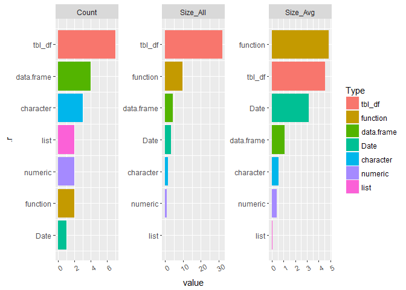

The seasmith package
================
Luke Smith

Luke's Utility Package
======================

Welcome to my utility package. This is a collection of "random" functions I have created

I use these functions at the command-line or store them in a single file (`utilities.R`) within other packages.

My current favorite:

``` r
library(seasmith)

# - Show the user workspace as a plot and data frame with seasmith::ls.summary().
ls.summary()
```

    ## # A tibble: 7 × 6
    ##         Type Count Size_All  Size_Avg  Rows Columns
    ##       <fctr> <int>    <dbl>     <dbl> <dbl>   <dbl>
    ## 1     tbl_df     7   31.872 4.5531429   248      32
    ## 2   function     2    9.768 4.8840000    NA      NA
    ## 3 data.frame     4    4.296 1.0740000    26       1
    ## 4       Date     1    3.168 3.1680000   365      NA
    ## 5  character     3    1.696 0.5653333    28      NA
    ## 6    numeric     2    0.888 0.4440000   101      NA
    ## 7       list     2    0.080 0.0400000     0      NA



``` r
library(tidyverse)

# Fill-in these implicit missing month-year values...
dread
```

    ## # A tibble: 11 × 2
    ##    mon_year     n
    ##      <fctr> <int>
    ## 1   11/2015     5
    ## 2   12/2015     7
    ## 3    1/2016     1
    ## 4    2/2016     2
    ## 5    4/2016     1
    ## 6    8/2016     2
    ## 7    9/2016     3
    ## 8   10/2016     7
    ## 9   11/2016     6
    ## 10  12/2016     6
    ## 11   1/2017    16

``` r
# ...by using seasmith::seq_fill_date_df()
dread %>%
  seasmith::seq_fill_date_df("mon_year")
```

    ## # A tibble: 15 × 2
    ##    mon_year     n
    ##      <fctr> <int>
    ## 1   11/2015     5
    ## 2   12/2015     7
    ## 3    1/2016     1
    ## 4    2/2016     2
    ## 5    3/2016    NA
    ## 6    4/2016     1
    ## 7    5/2016    NA
    ## 8    6/2016    NA
    ## 9    7/2016    NA
    ## 10   8/2016     2
    ## 11   9/2016     3
    ## 12  10/2016     7
    ## 13  11/2016     6
    ## 14  12/2016     6
    ## 15   1/2017    16
